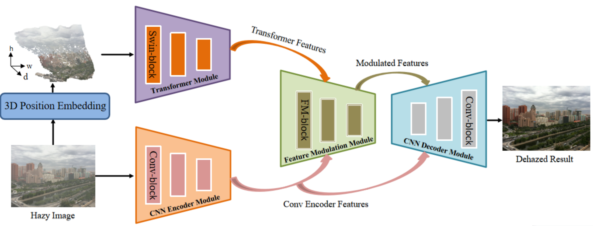
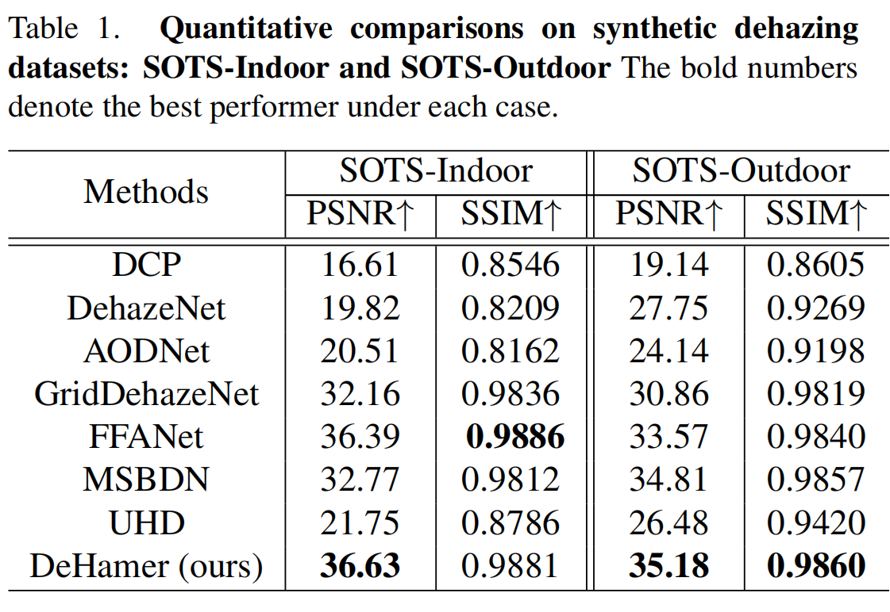
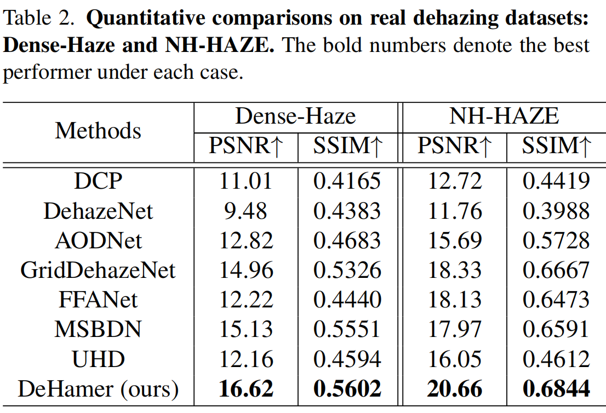

# Image Dehazing Transformer with Transmission-Aware 3D Position Embedding (CVPR2022)

This repository contains the official implementation of the following paper:
> **Image Dehazing Transformer with Transmission-Aware 3D Position Embedding**<br>
> Chun-Le Guo, Qixin Yan, Saeed Anwar, Runmin Cong, Wenqi Ren, Chongyi Li<sup>*</sup><br>
> IEEE/CVF Conference on Computer Vision and Pattern Recognition (**CVPR**), 2022<br>
**Paper Link:** [[official link](https://openaccess.thecvf.com/content/CVPR2022/papers/Guo_Image_Dehazing_Transformer_With_Transmission-Aware_3D_Position_Embedding_CVPR_2022_paper.pdf)] 

## Overview

Overview structure of our method. Our method consists of five key modules: a transmission-aware 3D position embedding module, a Transformer module, a CNN encoder module, a feature modulation module, and a CNN decoder module.
## Environment

1. Clone Repo

   ```bash
   git clone <code_link>
   cd Dehamer-main/
   ```

2. Create Conda Environment and Install Dependencies

   ```bash
   conda env create -f environment.yaml
   conda activate dehamer
   ```


## Prepare pretrained models and quick test
Before performing the following steps, please download our pretrained model first.

 **Download Links:** [[Google Drive](https://drive.google.com/drive/folders/1YZnKreDfqbs_GHB76Ko4qtifpPWPbCwU?usp=sharing)] [[Baidu Disk (password: 1tap)](https://pan.baidu.com/s/1i6A_Vjq-WUSLUJYMyYvlew)]

Then, unzip the file and place the models to `ckpts/<dataset_name>` directory, separately.

The directory structure will be arranged as:
```
ckpts
   |- dense
      |- PSNR1662_SSIM05602.pt  
   |- NH
      |- PSNR2066_SSIM06844.pt
   |- indoor
      |- PSNR3663_ssim09881.pt
   |- outdoor
      |- PSNR3518_SSIM09860.pt
```

We provide some classic test images in the [`classic_test_image`](./data/classic_test_image/) directory.

Run the following command to process them:
```shell

CUDA_VISIBLE_DEVICES=X python src/test_PSNR.py --dataset-name our_test  

```
The dehazed images will be saved in the `results/` directory.

You can also run the following command to process your own images:
```
CUDA_VISIBLE_DEVICES=X python src/test_PSNR.py \
  --dataset-name our_test -t path/to/your/test/folder   
```

## Prepare dataset for training and evaluation
<table>
<thead>
  <tr>
    <th>Dataset</th>
    <th>OTS-Train</th>
    <th>ITS-Train</th>
    <th>Dense-Haze</th>
    <th>NH-HAZE</th>
    <th>SOTS-Test</th>
  </tr>
</thead>
<tbody>
  <tr>
    <td>Details</td>
    <td>about 45G</td>
    <td>about 4.5G</td>
    <td>about 250M</td>
    <td>about 315M</td>
    <td>about 415M</td>   
  <tr>
    <td>Google drive</td>
    <td> <a href="https://drive.google.com/drive/folders/1i_tW1axmOjOy1InX1o3iS1nLnJ8TND7f?usp=sharing">Google drive</a></td>
    <td> <a href="https://drive.google.com/file/d/1lE6FyHS1MHoV6iM_s7phgf3Z3XJeC9E/view?usp=sharing">Google drive</a> </td>
    <td> <a href="https://drive.google.com/file/d/1OOyeu2pDM_OuE84qbV3eBy4pfP4xorVq/view?usp=sharing">Google drive</a> </td>
    <td> <a href="https://drive.google.com/file/d/1qPYGkCfVgn1Ami7ksf0DmKeKsoHVnm8i/view?usp=sharing">Google drive</a> </td>
    <td> <a href="https://drive.google.com/file/d/1IyZPih5BXB9ffgKneXf_FVpLus6Egmfn/view?usp=sharing">Google drive</a></td>
  </tr>
  <tr>
    <td>Baidu Cloud</td>
    <td> Not available </td>
    <td> <a href="https://pan.baidu.com/s/1rkIjRjRROr80R5JARTSRYA?pwd=vorb">Baidu Cloud</a></td>
    <td> <a href="https://pan.baidu.com/s/12sQIJQpBYq6EApLGKMurlg?pwd=ixen">Baidu Cloud</a> </td>
    <td> <a href="https://pan.baidu.com/s/1RGaVJ5kbd-cokE8ZAF_THw?pwd=801y">Baidu Cloud</a> </td>
    <td> <a href="https://pan.baidu.com/s/1T2UvbHIYabZ510-Df5NUdg?pwd=i02g">Baidu Cloud</a> </td>
  </tr>
</tbody>
</table>

The train and valid split files are provided in `data/<dataset_name>`.

The `data` directory structure will be arranged as: (**Note**: please check it carefully)
```
data
   |- classic_test_image
      |- input
         |- canyon.png
         |- canyon1.png
      |- val_list.txt
   |-Dense-Haze
      |- train_dense
         |- haze
            |- 01_hazy.png 
            |- 02_hazy.png
         |- clear_images
            |- 01_GT.png 
            |- 02_GT.png
         |- trainlist.txt
      |- valid_dense
         |- input 
            |- 51_hazy.png 
            |- 52_hazy.png
         |- gt
            |- 51_GT.png 
            |- 52_GT.png
         |- val_list.txt
   |-NH-Haze
      |- train_NH
         |- haze
            |- 01_hazy.png 
            |- 02_hazy.png
         |- clear_images
            |- 01_GT.png 
            |- 02_GT.png
         |- trainlist.txt
      |- valid_NH
         |- input 
            |- 51_hazy.png 
            |- 52_hazy.png
         |- gt
            |- 51_GT.png 
            |- 52_GT.png
         |- val_list.txt
   |-ITS
      |- train_indoor
         |- haze
            |- 1_1_0.90179.png 
            |- 2_1_0.99082.png
         |- clear_images
            |- 1.png 
            |- 2.png
         |- trainlist.txt
      |- valid_indoor
         |- input
            |- 1400_1.png 
            |- 1401_1.png
         |- gt
            |- 1400.png 
            |- 1401.png
         |- val_list.txt
   |-OTS   
      |- train_outdoor
         |- haze
            |- 0005_0.8_0.04.jpg 
            |- 0008_0.8_0.04.jpg
         |- clear_images
            |- 0005.jpg 
            |- 0008.jpg
         |- trainlist.txt
      |- valid_outdoor
         |- input
            |- 0001_0.8_0.2.jpg 
            |- 0002_0.8_0.08.jpg
         |- gt
            |- 0001.png 
            |- 0002.png
         |- val_list.txt
```


## Training

See `python3 src/train.py --h` for list of optional arguments, or `train.sh` for examples.

An example of NH-HAZE dataset.
```
CUDA_VISIBLE_DEVICES=0,1 python src/train.py \
  --dataset-name NH \
  --train-dir ./data/train_NH/ \
  --valid-dir ./data/valid_NH/ \
  --ckpt-save-path ../ckpts \
  --ckpt-overwrite \
  --nb-epochs 5000 \
  --batch-size 2\
  --train-size 800 1200  \
  --valid-size 800 1200 \
  --loss l1 \
  --plot-stats \
  --cuda   
```

## Testing
See `python3 test_PSNR.py --h` for list of optional arguments, or `test.sh` for an example.

An example of NH-HAZE dataset.
```
CUDA_VISIBLE_DEVICES=1 python src/test_PSNR.py \
  --dataset-name NH   
```


## Results
### Quantitative comparisons on synthetic dehazing datasets: SOTS-Indoor and SOTS-Outdoor.

### Quantitative comparisons on real dehazing datasets: Dense-Haze and NH-HAZE.

The results of our dehamer on benchmarks can also be download from [<a href="https://drive.google.com/drive/folders/1TWMFE2x6kVU2eOVqRPSjmyaejWVA8sqp?usp=sharing">Google drive</a>] and [<a href="https://pan.baidu.com/s/1jBL6NNadkSvbVhQj1TE3Ag">Baidu Disk (password: 13e2)</a>].


## Citation

   If you find our repo useful for your research, please consider citing our paper:

   ```bibtex
   @inproceedings{guo2022dehamer,
     author = {Chun-Le Guo, Qixin Yan, Saeed Anwar, Runmin Cong, Wenqi Ren, Chongyi Li},
     title = {Image Dehazing Transformer with Transmission-Aware 3D Position Embedding},
     booktitle = {Proceedings of the IEEE/CVF Conference on Computer Vision and Pattern Recognition},
     year={2022}
   }
   ```
## Contact

If you have any question, please feel free to contact us via `guochunle@nankai.edu.com` or `lichongyi25@gmail.com`.

## Acknowledgments

This code is based on [Swin-Transformer
](https://github.com/microsoft/Swin-Transformer), [Noise2noise](https://github.com/joeylitalien/noise2noise-pytorch), and [GridDehazeNet](https://github.com/proteus1991/GridDehazeNet).
